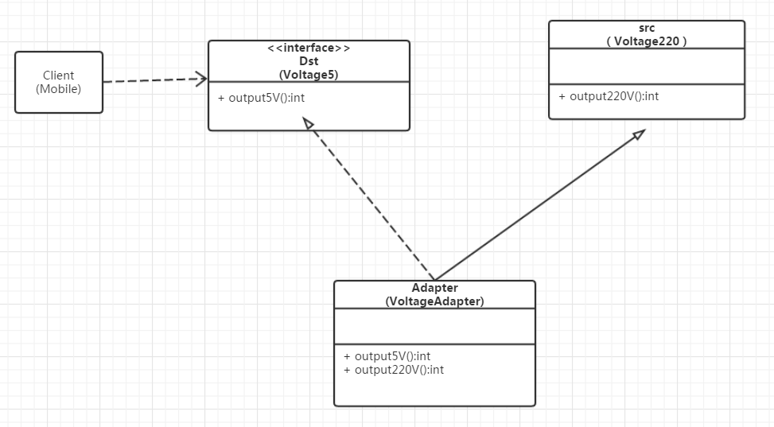
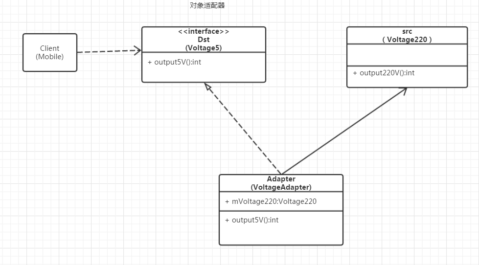

## 结构型

结构型模式(Structural Pattern)描述如何将类或者对 象结合在一起形成更大的结构，就像搭积木，可以通过 简单积木的组合形成复杂的、功能更为强大的结构。 

### 1. 适配器模式

适配器模式(Adapter Pattern) ：将一个接口转换成客户希望的另一个接口，适配器模式使接口不兼容的那些类可以一起工作，其别名为包装器(Wrapper)。适配器模式既可以作为类结构型模式，也可以作为对象结构型模式。 

适配器就是一种适配中间件，它存在于不匹配的二者之间，用于连接二者，将不匹配变得匹配，简单点理解就是平常所见的转接头，转换器之类的存在。

适配器模式包含如下角色：

- Target：目标抽象类
- Adapter：适配器类
- Adaptee：适配者类
- Client：客户类

 

#### 类适配器

一句话描述：Adapter类，通过**继承** src类，**实现** dst 类**接口**，完成src->dst的适配。

用电源适配器举例，我们需要5v的直流电，但是现在有的是220v的交流电。需要通过适配器转换

 

```php
class V220{
    public function output220V()
    {
        return "220";
    }
}
interface V5{
    public function output5V()
    {
        
    }
}

class Adapter extends V220 implements V5{
    //将220v转化成5v
    public function output5V()
    {
        $v = $this->output220V();
        return $v/44;
    }
}

```

这里可能有人会问，直接写一个类，然后 返回对应的5v不就行了吗。但是我们适配器模式的是将不合适的类，通过一个接口转成合适的。你直接写一个类的话，就是增加了一个类。而不是利用原来的类的功能。

#### 对象适配器

基本思路和类的适配器模式相同，只是将Adapter类作修改，这次不继承src类，而是持有src类的实例，以解决**兼容性**的问题。  即：**持有** src类，**实现** dst 类**接口**，完成src->dst的适配。  （根据“合成复用原则”，在系统中**尽量使用关联关系来替代继承关系**，因此大部分结构型模式都是对象结构型模式。） 

 ```php
class Adapter implements V5{
    public $v;
    public function __construct(V220 $v200)
    {
        $this->v = $v200
    }
    public function output5V()
    {
        if(!$this->v) {
            $v = $this->v->output220V();
            return $v/44;
        }
       
        return 0;
    }
}
 ```

 

### 2. 装饰器模式

> 装饰模式(Decorator Pattern) ：动态地给一个对象增加一些额外的职责(Responsibility)，就增加对象功能来说，装饰模式比生成子类实现更为灵活。其别名也可以称为包装器(Wrapper)，与适配器模式的别名相同，但它们适用于不同的场合。根据翻译的不同，装饰模式也有人称之为“油漆工模式”，它是一种对象结构型模式。 

装饰模式包含如下角色：

- Component: 抽象构件
- ConcreteComponent: 具体构件
- Decorator: 抽象装饰类
- ConcreteDecorator: 具体装饰类

 


```php
interface Component{
    public function run(){}
}

class Car implements Component{
    public function run(){
        echo " I am run";
    }
}

class Decorator extends Car {
    public function __construct()
    {
        parent::__construct();
    }
    public function run()
    {
        parent::run();
        $this->fly();
    }
    protected function fly()
    {
        echo "fly";
    }
}

$car = new Car();

$decorator = new Decorator();

```


### 阅读资料

- [适配器模式](https://blog.csdn.net/zxt0601/article/details/52848004)