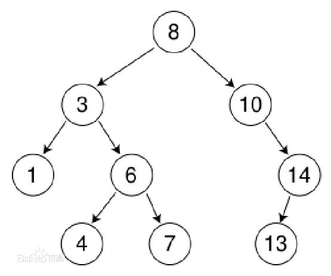

## 收集的笔试题

1、给你四个坐标点，判断它们能不能组成一个矩形，如判断([0,0],[0,1],[1,1],[1,0])能组成一个矩形。

2、写一段代码判断单向链表中有没有形成环，如果形成环，请找出环的入口处，即P点

3、写一个函数，获取一篇文章内容中的全部图片，并下载

```php
preg_match_all('/<\s*img[^src]*src\s*=\s*"[^"]*"/',$string,$data);
```

4、获取当前客户端的IP地址，并判断是否在（111.111.111.111,222.222.222.222)

注意:（111.111.111.111,222.222.222.222) 这是一个集合区间，不是数组的array

利用php获取ip地址。 然后转成long

```php
public function ip() {
    //strcasecmp 比较两个字符，不区分大小写。返回0，>0，<0。
    if(getenv('HTTP_CLIENT_IP') && strcasecmp(getenv('HTTP_CLIENT_IP'), 'unknown')) {
        $ip = getenv('HTTP_CLIENT_IP');
    } elseif(getenv('HTTP_X_FORWARDED_FOR') && strcasecmp(getenv('HTTP_X_FORWARDED_FOR'), 'unknown')) {
        $ip = getenv('HTTP_X_FORWARDED_FOR');
    } elseif(getenv('REMOTE_ADDR') && strcasecmp(getenv('REMOTE_ADDR'), 'unknown')) {
        $ip = getenv('REMOTE_ADDR');
    } elseif(isset($_SERVER['REMOTE_ADDR']) && $_SERVER['REMOTE_ADDR'] && strcasecmp($_SERVER['REMOTE_ADDR'], 'unknown')) {
        $ip = $_SERVER['REMOTE_ADDR'];
    }
    $res =  preg_match ( '/[\d\.]{7,15}/', $ip, $matches ) ? $matches [0] : '';
    return $ip;
}
$ip = sprintf('%u',ip2long(ip());
$begin = sprintf('%u',ip2long('111.111.111.111'))
$end = sprintf('%u',ip2long('222.222.222.222'))
if($ip > $begin && $ip < $end) {
    echo "在这个区间里"。
}
```


5、nginx的log_format配置如下：
log_format main ‘remoteaddr−remote_user [timelocal]"request”’
‘statusbody_bytes_sent “httpreferer"″"http_user_agent” “upstreamresponsetime""request_time” “http_x_forwarded_for"';
从今天的nginx log文件 access.log中：

   a、列出“request_time”最大的20行？

```shell
cat access.log | awk '{arr[$4]++} END {for(i in arr) {print arr[i],$0}}' | sort -r | head -10
```

   b、列出早上10点访问量做多的20个url地址？

6、什么是CSRF攻击？XSS攻击？如何防范？

csrf 跨站请求攻击。验证码、token、检测refer

xss 跨站脚本攻击，过滤用户输入。

7、应用中我们经常会遇到在user表随机调取10条数据来展示的情况，简述你如何实现该功能。

```shell
function get_random_array($min,$max,$number)
{
  $data = [];
  for($i = 0;$i<$number;$i++;)
  {
    $d = mt_rand($min,$max);
    if(in_array($d,$data)) {
      $i--;
    }else{
      $data[] = $d;
    }
    
  }
  return $data;
}

$sql = 'select * from user where user_id in (' .join(",",get_random_array($min,$max,$number)). ')'
```

8、从扑克牌中随机抽5张牌，判断是不是一个顺子，即这5张牌是连续的

9、两条相交的单向链表，如何求它们的第一个公共节点

10、最长公共子序列问题LCS，如有[1,2,5,11,32,15,77]和[99,32,15,5,1,77]两个数组，找到它们共同都拥有的数，写出时间复杂度最优的代码，不能用array_intersect（这里有坑，需要去研究一下动态规划）。

11、linux的内存分配和多线程原理

12、MYSQL中主键与唯一索引的区别

13、http与https的主要区别

14、http状态码及其含意

15、linux中怎么查看系统资源占用情况

16、SQL注入的原理是什么？如何防止SQL注入

17、isset(null) isset(false) empty(null) empty(false)输出

18、优化MYSQL的方法

19、数据库中的事务是什么？

20、写一个函数，尽可能高效的从一个标准URL中取出文件的扩展名

21、参数为多个日期时间的数组，返回离当前时间最近的那个时间

22、echo、print、print_r的区别

23、http协议的header中有哪些key及含义

24、二叉树前中后遍历代码

25、PHP的数组和C语言的数组结构上有何区别？

26、Redis的跳跃表怎么实现的

27、哈希是什么？hash冲突后，数据怎么存？

28、聚簇索引，聚集索引的区别？

29、B+Tree是怎么进行搜索的

30、数组和hash的区别是什么？

31、写个函数，判断下面扩号是否闭合，左右对称即为闭合： ((()))，)(())，(())))，(((((())，(()())，()()

32、 找出数组中不重复的值[1,2,3,3,2,1,5]

33、32题你的时间复杂度是多少？有的情况下，你写了个算法，然后面试官会让你把你的算法的时间复杂度表达式写出来

34、PHP的的这种弱类型变量是怎么实现的？

35、在HTTP通讯过程中，是客户端还是服务端主动断开连接？

36、PHP中发起http请求有哪几种方式？它们有何区别？

37、有一颗二叉树，写代码找出来从根节点到flag节点的最短路径并打印出来，flag节点有多个。比如下图这个树中的6和14是flag节点，请写代码打印8、3、6 和 8、10、14两个路径


 38 、实现一个单例

 39、冒泡排序
